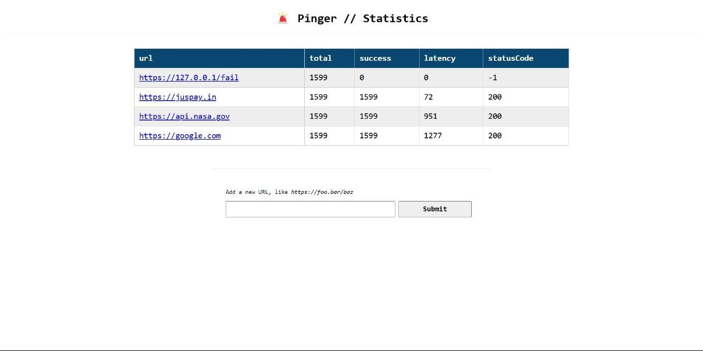
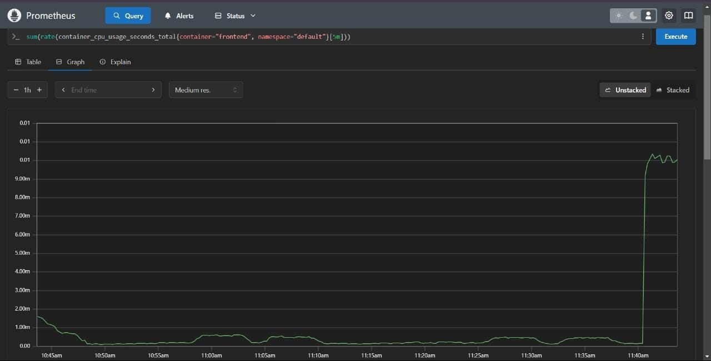
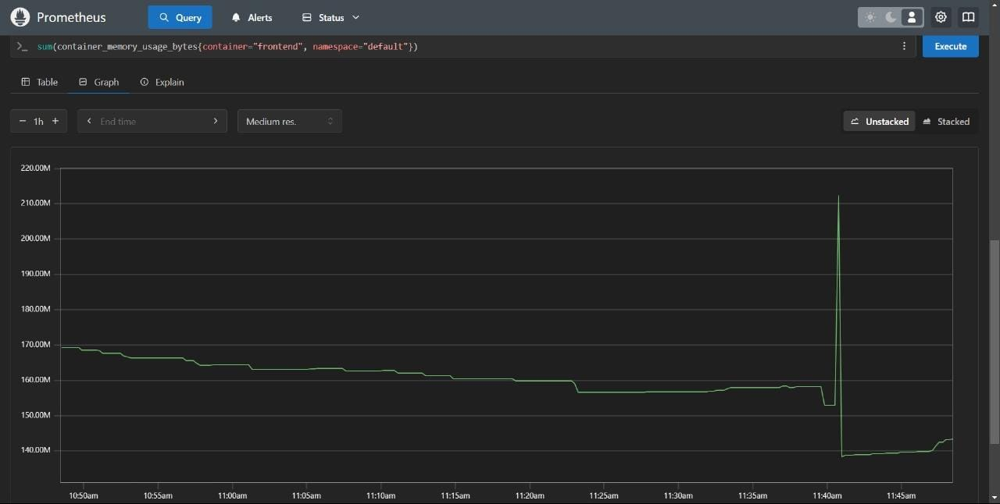
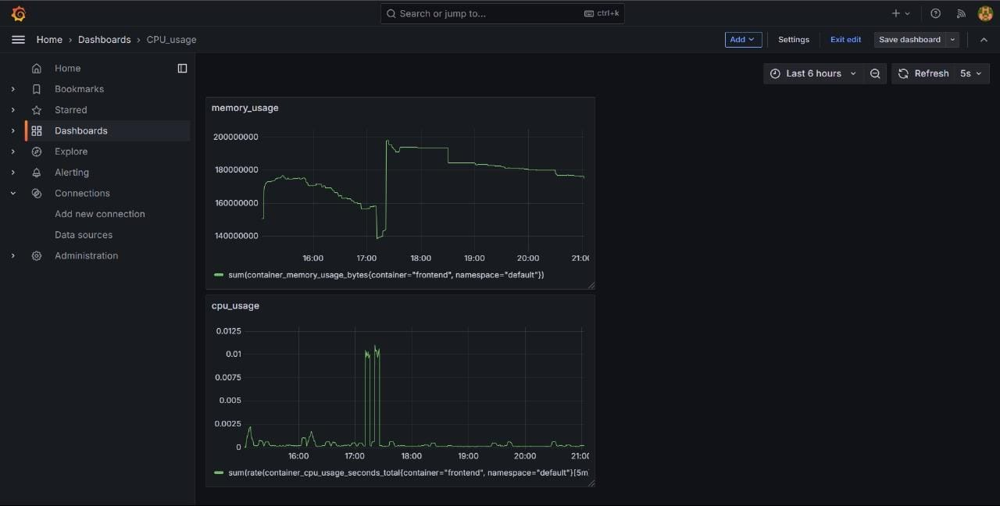

# Real-Time Website Metrics Monitoring & Visualization

## Overview
This project is focused on **real-time website monitoring and visualization**, leveraging **Kubernetes**, **Docker**, **Prometheus**, and **Grafana**. The goal is to track and analyze key metrics like **CPU usage, memory consumption**, and more, ensuring system reliability and performance. 

## Prerequisites
To successfully set up and run this project, ensure the following prerequisites are met:

- **Operating System**: Ubuntu (or any Linux-based system)
- **Docker**: Installed and configured for container management
- **Kubernetes**: Set up with a functional cluster
- **kubectl**: CLI tool to interact with Kubernetes clusters
- **Helm**: Package manager for Kubernetes applications
- **Prometheus & Grafana**: Installed and configured for monitoring and visualization
- **Basic Knowledge**:
  - Working with Linux commands & shell scripting
  - Understanding of Kubernetes concepts (pods, deployments, services)
  - Familiarity with PromQL (Prometheus Query Language) for querying metrics

## Workflow
1. **Infrastructure Setup**: Kubernetes clusters and Docker containers are configured on Ubuntu using PowerShell.
2. **Deploying Pinger Web Application**: A lightweight web application, **Pinger**, is launched to generate and expose performance metrics.
3. **Integrating with Prometheus**: Prometheus is set up to scrape data from Pinger and store performance metrics using **PromQL (Prometheus Query Language)**.
4. **Visualizing Data with Grafana**: Prometheus is connected to Grafana, which provides powerful visualizations of real-time data.
5. **Performance Tracking**: Key website performance indicators are monitored, allowing for proactive issue resolution and optimization.

## Why This Matters
### Real-Time Insights
- Enables live tracking of website performance, ensuring a seamless user experience.

### Advanced Visualization
- Grafana’s rich dashboards provide deep insights into CPU/memory usage, request latency, and system health.

### Data-Driven Decision Making
- Helps identify bottlenecks and optimize resource allocation based on **real-world metrics**.

### Scalable & Automated
- Easily integrates into any cloud or on-premise infrastructure, making it **ideal for production environments**.

## Real-World Use Cases
- **E-commerce & SaaS**: Ensures uptime and smooth customer experiences by proactively detecting performance issues.
- **Cloud & DevOps**: Helps teams optimize cloud resource utilization and detect anomalies in real-time.
- **Cybersecurity**: Continuous monitoring can detect unusual spikes in traffic, which may indicate security threats.

## Introduction to PromQL
PromQL (Prometheus Query Language) allows efficient metric querying. Example:
```promql
rate(http_requests_total[5m])
```
This retrieves the average number of HTTP requests over the last 5 minutes, helping analyze traffic patterns.

## Challenges & Solutions Faced
### Challenge: Ensuring Persistent Data Storage
- **Solution**: Used **Persistent Volumes (PV) & Persistent Volume Claims (PVC)** in Kubernetes to avoid data loss.

### Challenge: Scaling Prometheus & Grafana
- **Solution**: Configured **federated Prometheus** setup and Grafana’s **multi-instance scaling** for high availability.

### Challenge: Securing Access to Metrics
- **Solution**: Implemented **authentication & authorization** using Grafana’s **RBAC (Role-Based Access Control)**.

## Screenshots
1. Pinger Web UI
   
2. Prometheus CPU usage
   
3. Prometheus Memory usage
   
4. Grafana Dashboard
   

## Notes
- Ensure Kubernetes clusters and Docker are set up before deploying the Pinger application.
- Prometheus and Grafana must be properly configured for seamless integration.
- Use **PromQL** to query live website metrics efficiently.

## Contributors
- Priyanka V S
- Shreyas C
- Shreeharsh Joshi
- Sanath Yergol
- Karthik Kosigi
